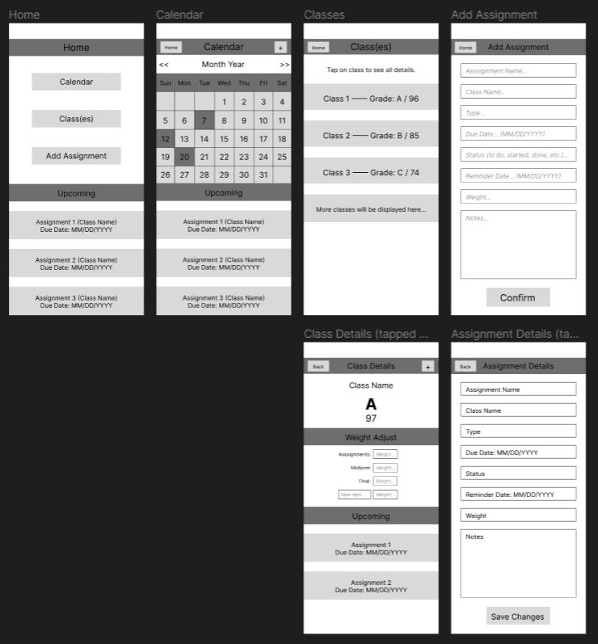

# Specification Phase Exercise

A little exercise to get started with the specification phase of the software development lifecycle. See the [instructions](instructions.md) for more detail.

## Team members

See instructions. Delete this line and replace with a list of the names of your team members, including links to each one's GitHub profile.

Eric Emmendorfer https://github.com/ericemmendorfer

[Zhongqian Chen (John)](https://github.com/ZhongqianChen) (https://github.com/ZhongqianChen)

Hojong Shim https://github.com/HojongShim

## Stakeholders

The following is an interview conducted with Eddie Kim a Student Athlete at NYU in his Sophomore year, interviewed by Eric Emmendorfer.

Start of Interview

Q: So Eddie, you are currently a college student athlete, what do you think is the hardest part about doing both school and sports?
A: I think the hardest part for me has been time management. It has been hard to get all of my work on time during weeks where practice feels extraordinarily long, or we are traveling for a tournament. 

Q: Do you have any calendar apps that you use to help you keep track of assignments?
A: Yes, I do however, I often forget about big assignments until the day before when I see them in my calendar app and sometimes I do not have time to complete them with practice and traveling.

Q: Do you use Brightspace, to look at whats coming up to help manage the bigger task?
A: Yes I do, however when I am on the move and I try to use brightspace on my phone it is pretty hard to use and hard to see everything. 

Q: Aside from homework and test, are there any other things regarding school you try to keep track of?
A: I am constantly concerned about my grades, I look at them often but it can be hard to know how I am actually doing when professors are slow to update assignments in Brightspace or they are not weighted correctly. 

Q: What about when going to school or practice, are you able look to help keep track of what you should be getting done during any given day?
A: No, I take the subway to both school and practice so normally I can not look to see Brightspace or Albert because I do not get good service in the subways. 

Eric: I see, thank you for your time Eddie.

End of Interview

Problems identified: Time management for task, reminders of task further in advence, mobile viewing for school websites, keeping track of grades, being able to see all of this offline or with spotty service. 

## Product Vision Statement

The vision for our project is to create an app that allows students to better manage their school work. The product will have the ability for students to add their courses and assignments in order to help them better manage their school work. Assignments will allow for individuals to set their due dates on a calendar view as well as set reminders of when they should be starting them. Classes will allow a way for students to see their grades in a given class, and update them based of off grades recieved and the weight of assignments. This app will be an easy to use task manager and progress checker to help students accomplish their academic goals.

## User Requirements
Use Cases:
1. "As a student with many extra curricular activities, I want a way to better organize assignments I have to get done so that I can better manage my time."
2. "As a student who wants to remain on honor roll, I want a way to better visualize my grades so that I can keep track of where I am at in school."
3. "As a student who has a hard time looking at multiple syllabi, I want one place to see all my assignments so that I do not miss any deadlines."
4. "As a studnet that constantly puts stuff off until the last minute, I want a reminder of when to start assignments so that I am not rushed to complete all of them."
5. "As a student who is tired of using brightspace, albert, and google calendars to manage everything, I want one space to see everything I need to so that save time switching back and forth from everything."
6. "As a student with a lot of bigger projects and essays, I want a way to break them up and give myself deadlines so that I don't spend my Sundays doing nothing but work."
7. "As a student consistently stressed about my grades, I want a way to see where I at consistently so that I can feel more in control of them."
8. "As a student tired of dual authentication, I want a way to see everything for school on my phone so that I don't have to wait for a notification everytime."
9. "As a student commuter, I want a way to look at my assignments off line so that I can see everything I have to do while on the subway."
10. "As a student without a laptop, I want to be able to maintain all of my school information so that I don't have to use the poorly designed mobile versions of Albert and Brightspace."

## Activity Diagrams

See instructions. Delete this line and place images of your UML Activity diagrams here.

## Clickable Prototype

[Wireframe diagrams (by Zhongqian Chen)](https://www.figma.com/file/EHfK0fJhEfNFVBMvfjG5To/Assignment-Manager-Wireframe?type=design&node-id=0%3A1&mode=design&t=XyX91CfQeFv8dazp-1)

[Clickable prototype (by Hojong Shim)] (https://www.figma.com/proto/EHfK0fJhEfNFVBMvfjG5To/Assignment-Manager-Wireframe?type=design&node-id=2-105&t=6gW3xnWnpC2vbQx2-1&scaling=scale-down&page-id=0%3A1&mode=design)
