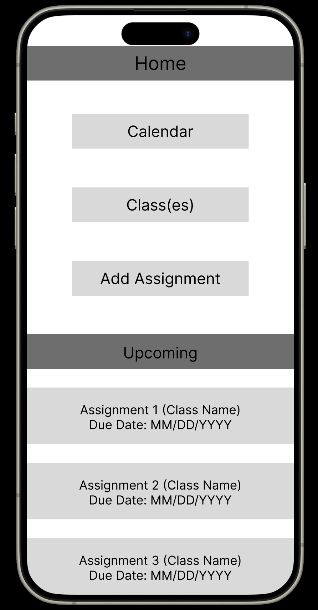

# Specification Phase Exercise

A little exercise to get started with the specification phase of the software development lifecycle. See the [instructions](instructions.md) for more detail.

## Team members

See instructions. Delete this line and replace with a list of the names of your team members, including links to each one's GitHub profile.

Eric Emmendorfer https://github.com/ericemmendorfer

[Zhongqian Chen (John)](https://github.com/ZhongqianChen) (https://github.com/ZhongqianChen)

[Hojong Shim](https://github.com/HojongShim) (https://github.com/HojongShim)

## Stakeholders

See instructions. Delete this line and replace with the name(s) of the stakeholder(s) you interviewed and lists showing their goals/needs, and problems/frustrations.

## Product Vision Statement

See instructions. Delete this line and place your Product Vision Statement here.

## User Requirements

See instructions. Delete this line and place a list of your User Stories here.

## Activity Diagrams

See instructions. Delete this line and place images of your UML Activity diagrams here.

## Clickable Prototype

[Wireframe diagrams (by Zhongqian Chen)](https://www.figma.com/file/EHfK0fJhEfNFVBMvfjG5To/Assignment-Manager-Wireframe?type=design&node-id=0%3A1&mode=design&t=XyX91CfQeFv8dazp-1)

[Clickable prototype (by Hojong Shim)](https://www.figma.com/proto/EHfK0fJhEfNFVBMvfjG5To/Assignment-Manager-Wireframe?type=design&node-id=2-105&t=6gW3xnWnpC2vbQx2-1&scaling=scale-down&page-id=0%3A1&mode=design) 

 

